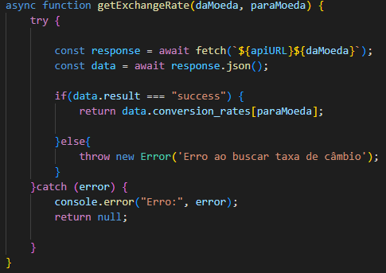
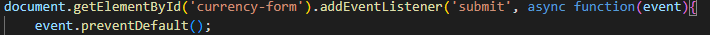
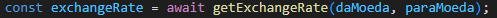
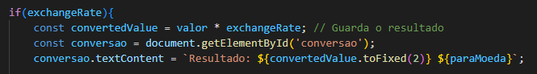
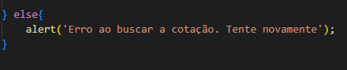

## **🪙 Conversor de moedas em tempo real 🪙**
## **📖 Introdução**
Este projeto é um conversor de moeda em tempo real!
Ele utiliza uma **API** para apresentar sempre dados atualizados e recentes do preço das moedas, o site que eu utilizei para pegar a API é o [ExchangeRate-API](https://app.exchangerate-api.com). Este COnversor até agora só converte para 3 moedas diferentes Dólar(USD), Euro(EUR) e Real(BRL), mas futuramente pode receber uma atulização para mais moedas para maior diversidade.

## **⚙️ Funcionalidades**
* **Entrada de Valor:** 
O usuário terá a opção de inserir o valor que deseja converter.
 
 
* **Seleção de Moedas:** 
O sistema permitirá que o usuário escolha a moeda de origem e a moeda de destino a partir de uma lista de opções, como Dólar, Euro e Real.
 
 
* **Conversão em tempo real:**
 O sistema fará a conversão usando uma API de câmbio (definida previamente no código pela ExchangeRate-API) e mostrará o valor convertido mais atualizado da moeda selecionada pelo usuário.
 
 
* **Reset:**
O usuário terá a opção de ajustar o valor e as escolhas de moedas para efetuar uma nova conversão.
 
 
* **Exibição de resultados**
Após a conversão o resultado sera apresentado no final do fomulário indicando a moeda escolhida e convertida e com o valor atulizado em tempo real.

## **📖 Explicação de código JavaScript**

**1. Conectando a API ao Código**
 
No início do código já temos duas `const` que pegam a `APIKey` que é única para cada usuário e é disponibilizado pela **API** escolhida no meu caso é a **[ExchangeRate-API](https://app.exchangerate-api.com)** e também outra `const` que pega o **Link que é a URL** da **API**.

**2. Consulta a taxa de câmbio via API** 

* Aqui o código cria uma função assíncrona chamada `getExchangeRate` que busca a taxa de câmbio entre duas moedas específicas que serão indicadas pelo usuário a `daMoeda` e `paraMoeda`.

* Adiante, o código cria um bloco `Try-catch` e ele é utilizado para para lidar com os erros de uma forma segura. Isso permite capturar erros de execução e evitar que o programa trave.

**Requisição a API**
 

* A linha `const response = await fetch(${apiURL}${daMoeda});` faz uma requisição à API, concatenando o `apiURL` com a moeda de origem.
* `await` faz com que a função pause até que a resposta da API seja recebida.

**Processamento dos dados**
 

* A `const data = await response.json();` converte a resposta da **API** em um objeto **JSON** para que os dados possam ser acessados em **JavaScript**.

**Validação do resultado**

* O código verifica se a propriedade `result` no objeto `data` é igual a `"success"`. Isso indica que a **API** retornou dados válidos.

**Retorno da taxa de câmbio**
* Se a resposta foi bem-sucedida, a função retorna a taxa de câmbio para a moeda de destino `(data.conversion_rates[paraMoeda])`.

**Tratamento de erro**
* Se o valor de `data.result` não for `"success"`, a função lança um erro com a mensagem **"Erro ao buscar taxa de câmbio"**.
* O bloco `catch` captura esse erro e o exibe no **`console`**, retornando `null` para indicar uma falha na obtenção da taxa.

 

**3. Obtem a consulta da API e faz os cálculos**
Esse código adiciona um evento de submissão ao formulário de câmbio com o **ID** `currency-form`. Quando o usuário submete o formulário, ele impede o envio padrão e processa a conversão da moeda usando uma função assíncrona. Vamos analisar o código em partes:

**Resumo**
Esse código permite que o usuário insira um valor e escolha duas moedas para realizar uma conversão. Ele usa uma API para buscar a taxa de câmbio, calcula o valor convertido e exibe o resultado no próprio formulário.

**Configuração do Evento**

* O código usa `addEventListener` para ouvir o evento `submit` no formulário com o **ID** `currency-form`.
* `event.preventDefault()` impede que o formulário seja enviado para o servidor e recarregue a página. Em vez disso, a função que segue é executada.

**Obtendo Valores de Entrada**

* O código obtém os valores digitados pelo usuário:
* `valor`: valor a ser convertido, obtido a partir do campo de entrada com **ID** `amount`.
* `daMoeda`: moeda de origem da conversão, obtida do campo `daMoeda`.
* `paraMoeda`: moeda de destino, obtida do campo `paraMoeda`.
* `parseFloat` é usado para converter o valor de entrada para um número decimal (ponto flutuante).

**Obtendo a Taxa de Câmbio**

* A função `getExchangeRate`, chamada com `await`, retorna a taxa de câmbio entre `daMoeda` e `paraMoeda`.
* `await` faz com que o código espere a resposta da função assíncrona antes de continuar.

**Calculando e Exibindo o Resultado**

* Se `exchangeRate` é válido, o valor convertido é calculado multiplicando o valor inicial pela taxa de câmbio.
* `convertedValue.toFixed(2)` formata o valor convertido para duas casas decimais.
* O elemento com **ID** ``conversao`` exibe o resultado no formato: Resultado: ``<valor convertido> <paraMoeda>``.

**Tratamento de Erro**

* Se `exchangeRate` for `null` (indicando um erro ao buscar a taxa de câmbio), o código exibe uma mensagem de alerta ao usuário.

 

## **💡 Descrição de algumas funções**
**Await**

* A expressão `await` faz a execução de uma função `async` pausar, para esperar pelo retorno da `Promise`, e resume a execução da função `async` quando o valor da `Promise` é resolvido. Ele então retorna o valor final da `Promise`. Se esse valor não for uma `Promise`, ele é convertido para uma `Promise` resolvida.

**Const**

* Constantes possuem escopo de bloco, semelhantes às variáveis declaradas usando o palavra-chave `let`. O valor de uma constante não pode ser alterado por uma atribuição, e ela não pode ser redeclarada.

## **🔭 Tecnologias**
 

 
   
   
   
   
 

 
 
## **🔎 Referência**

[Mdn Web Docs](https://developer.mozilla.org/pt-BR/)

##

## **📡 Link da API Utilizada nesse Projeto**

[ExchangeRate-API](https://app.exchangerate-api.com)

 
## **🙋🏻‍♀️ Quer me conhecer?**
  

   
   
    

